In this section, as the IEEE Firat Image Processing Team, We have learned image processing and made a project.

# Letter and Digit Detection

The repository is basically about detection of letters and digits in an image with deep learning. We Learned how to do,
and we applied what is learned.

---

## The Team

<div align="center">

| <a href="https://github.com/UmutGuzel" target="_blank">Umut</a>                           | <a href="https://github.com/Burakblm" target="_blank">Burak</a>                            | <a href="https://github.com/pc-eng65" target="_blank">Asım</a>                            |
|-------------------------------------------------------------------------------------------|--------------------------------------------------------------------------------------------|-------------------------------------------------------------------------------------------|
|  |  |  |
</div>

---

## Project Structure

The project have two steps.

1) Step One
    * In this step, main purpose is to classify single letter or digit in the input image.
    * The model is trained in this step.

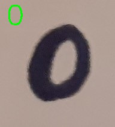

2) Step Two
    * In this step, main purpose is detect multiple letter and digit in the input image.
    * The model, that was trained previous step, is used for classifying the detections 

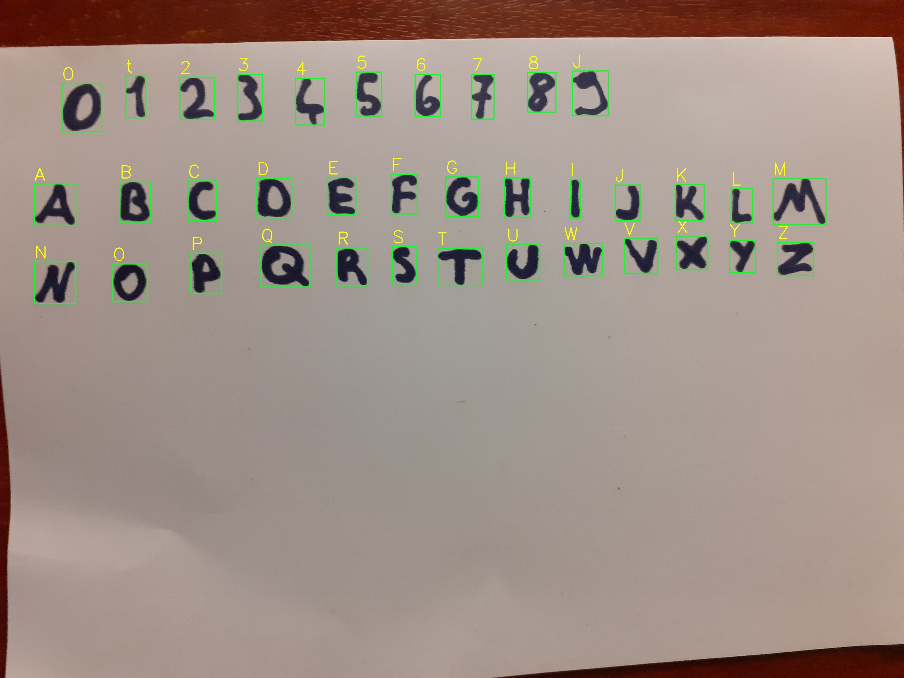

---

### 1) Step One: Classify Single letter in the image

This step is main structure of the project. Because, The model was trained in this step, and it uses step two.
<br>
First of all, The model was needed data for training. Data collection and preparing are time consuming process, and
require different skills. For those reasons, we as a team have decided to use a ready dataset. We used balanced emnist
data set. there are digits and letters in the dataset.


There are some problems in the dataset. If the dataset is checked, the problems can be seen. <br>
Some of them;

* Too smiler different labeled data
* Incorrectly labeled data
* Out of label images

Those problems affect the model accuracy in a bad way. <br>
The model can be observed with a confusion matrix.
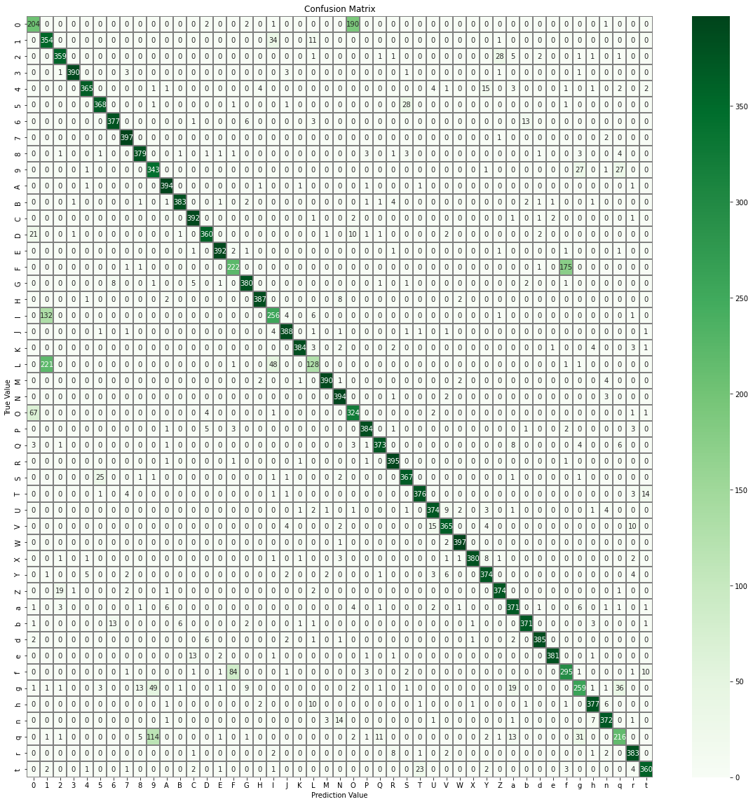

Prediction bar plots are helped us for more clear observation.

|  | 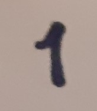 |  | 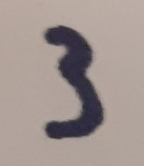 |  |
|:------------------------------------------------------:|:------------------------------------------------------:|:------------------------------------------------------:|:------------------------------------------------------:|:------------------------------------------------------:|
|       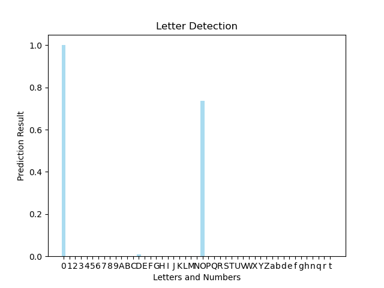       |       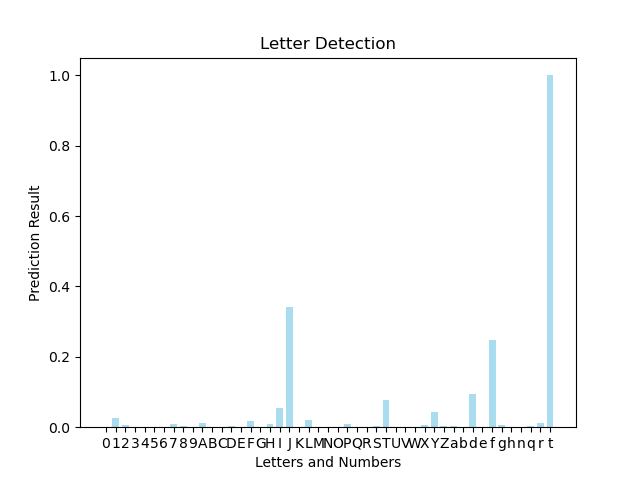       |       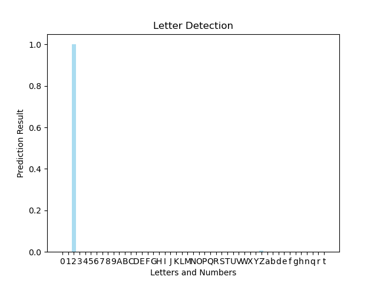       |       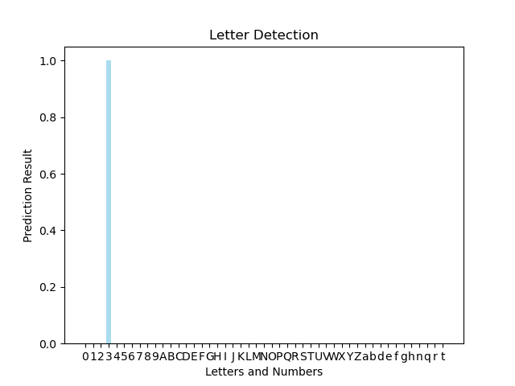       |       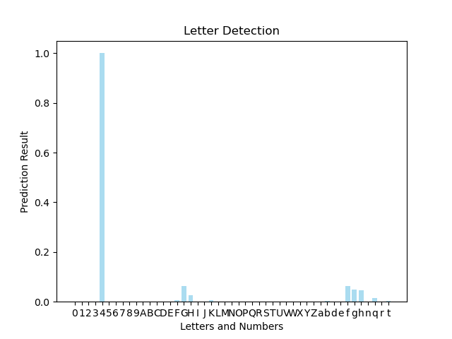       |
| 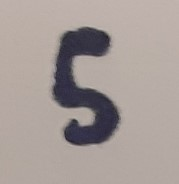 | 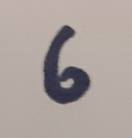 | 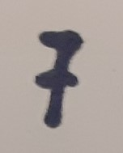 | 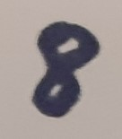 | 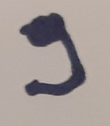 |
|              |              |       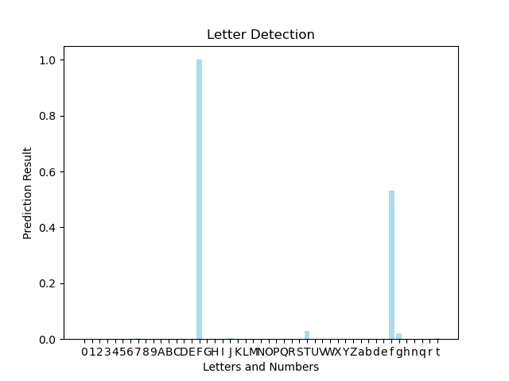       |       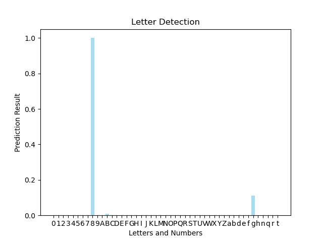       |       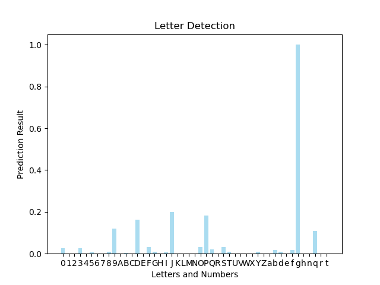       |

### 2) Step Two: Classify Multiple letter in an image

If we want to classify multiple areas in an image, we should find the areas. Because we want to use the model.
We used image processing technique for find the areas. You can use just a model that is trained for this purpose without image proccesing techniques, 
but you cannot use only image classification model for this. For that reason, we used image processing techniques in this step.
<br>
Every detected area passing the model, and the model predict the input. For every area, a rectangle and the prediction letter is drawn.

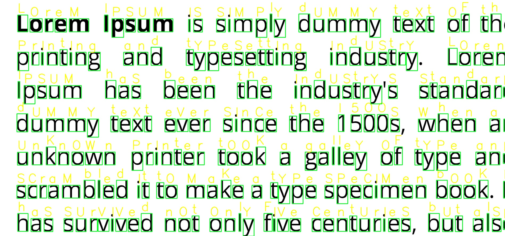

---

## The Model

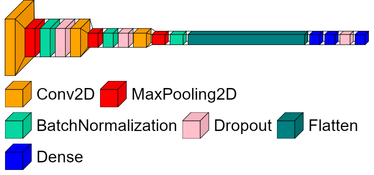

We trained two model. One of them is using 1D convolution layers(1dmodel), other is using 2D convolution layers(2dmodel).

Accuracy of 1dmodel is worse then 2dmodel. Probobly, 1dmodel can preform better with better hyperparameter tuning.
The project is using 2dmodel because of accuracy issue, and lesser image process steps.

You can find two of them in models folder.

---

## How to use?

First of all, you should clone the repository.
After that, you should install requirements. You can use the CLI commend.
```shell
pip install -r requirements.txt
```

Now you can run the project

### Single letter or digit
```shell
python main.py -s <image_path>
```

### Multiple letter or digit
```shell
python main.py -m <image_path>
```

