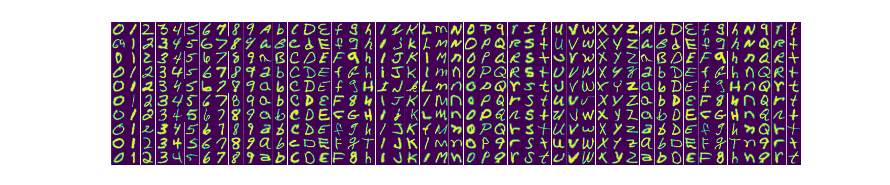
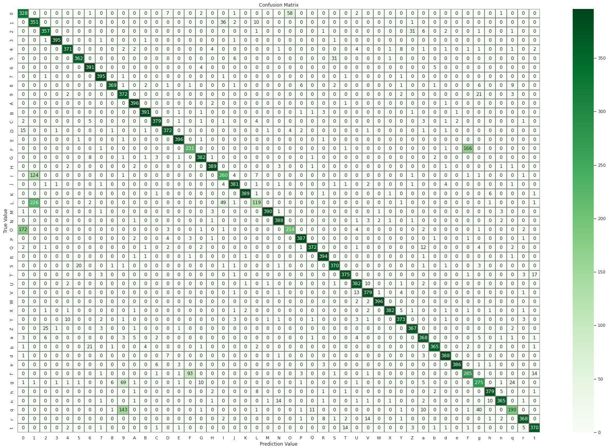
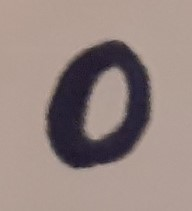
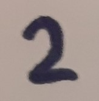
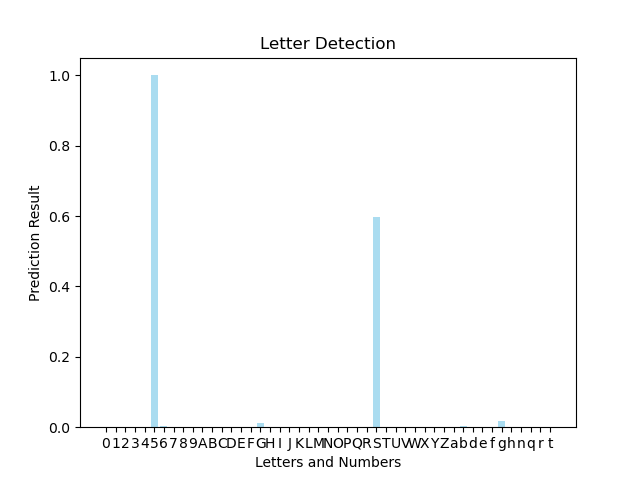
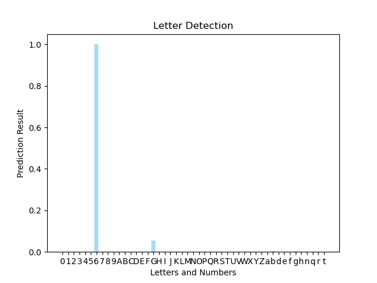

In this section, as the IEEE Firat Image Processing Team, We have learned image processing and made a project.

# Letter and Digit Detection

The repository is basically about detection of letters and digits in an image with deep learning. We Learned how to do,
and we applied what is learned.

---

## The Team

| <a href="https://github.com/UmutGuzel" target="_blank">Umut</a>                           | <a href="https://github.com/Burakblm" target="_blank">Burak</a>                            | <a href="https://github.com/pc-eng65" target="_blank">Asım</a>                            |
|-------------------------------------------------------------------------------------------|--------------------------------------------------------------------------------------------|-------------------------------------------------------------------------------------------|
|  |  |  |

---

## Project Structure

The project have two steps.

1) Step One
    * In this step, main purpose is to classify single letter in an input image.
    * This step will be bases of other steps.

<!-- PUT RELATED PHOTO --->

2) Step Two
    *

---

### 1) Step One: Classify Single letter in the image

This step is main structure of the project. Because, The model was trained in this step, and it uses step two.
 
First of all, The model was needed data for training. Data collection and preparing are time consuming process, and
require different skills. For those reasons, we as a team have decided to use a ready dataset. We used balanced emnist
data set. there are digits and letters in the dataset.

There are some problems in the dataset. If the dataset is checked, the problems can be seen.  
Some of them;

* Too smiler different labeled data
* Incorrectly labeled data
* Out of label images

Those problems affect the model accuracy in a bad way.  
The model can be observed with a confusion matrix.

Prediction bar plots are helped us for more clear observation.

|  |  |  |  |  |
|:------------------------------------------------------:|:------------------------------------------------------:|:------------------------------------------------------:|:------------------------------------------------------:|:------------------------------------------------------:|
|              |              |              |              |              |
|  |  |  |  |  |
|              |              |              |              |              |

### 2) Step Two: Classify Multiple letter in the image
